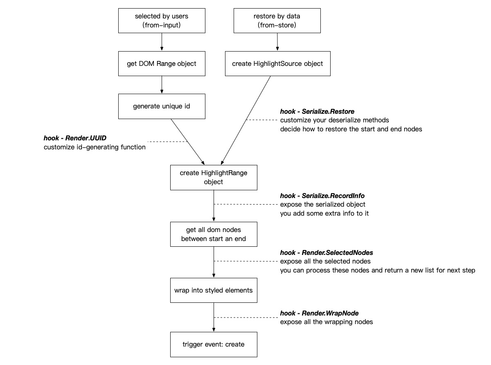
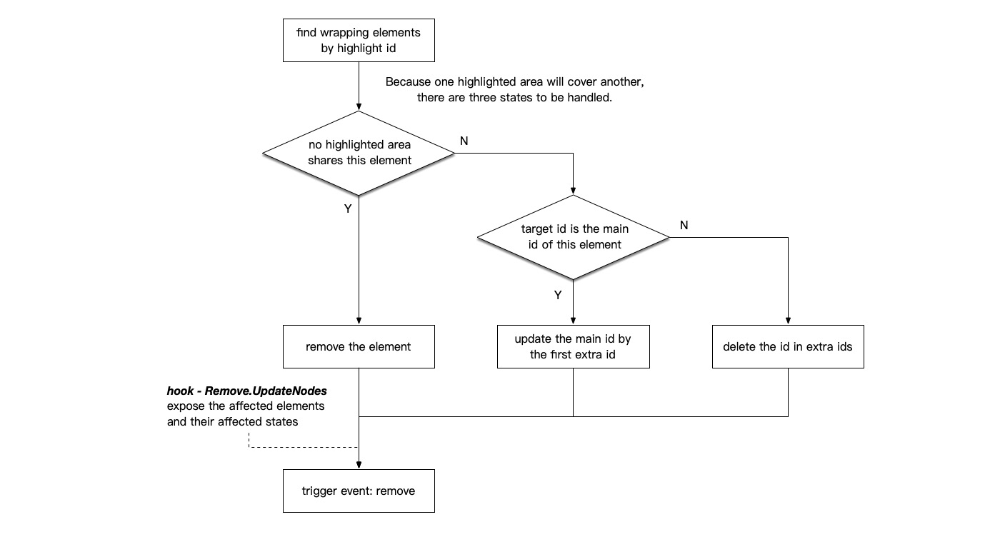

# Internal workflows and hooks

This part shows you

- how web-highlighter creates a new highlighted area and how it removes thems
- when each hook will be called and its usage

## Workflow - Creating highlighted areas



## Workflow - Removing highlighted areas



## Hooks - Use sample

```JavaScript
// UUID hook
const highlighter = new Highlighter();
highlighter.hooks.Render.UUID.tap(function (start, end, text) {
    // do something to generate your own id
    return id;
});
```

## Hooks - List

### Render.UUID

Hook into the process of generating a unique id.

**arguements:**

- start: DOM info of the start node
- end: DOM info of the end node
- text: text content in the highlighted area

**return value needed:**

- A new unique id.

## Render.SelectedNodes

Process all the text nodes in the highlighted area and return a new list by using this hook.

**arguements:**

- id: id of the highlighted area
- selectedNodes: all the text nodes in the highlighted area

**return value needed:**

- the text nodes need to be wrapped

## Render.WrapNode

Process the wrapping elements.

**arguements:**

- id: id of the highlighted area
- node: the wrapping elements

**return value needed:**

- the wrapping elements

## Serialize.RecordInfo

Add or modify some extra info when serialize the `HighlightRange` object.

**arguements:**

- start: meta info of the start node
- end: meta info of the end node
- root: the root element

**return value needed:**

- extra info: it will be added to the `extra` field in the `HighlightSource` object

### Remove.UpdateNodes

Process the affected wrapping elements when remove highlighted areas.

**arguements:**

- id: id of the highlighted area
- nodes: the affected wrapping elements
- type: affected type or state, one of `remove`, `id-update` and `extra-update`

**return value needed:**

- `void`
